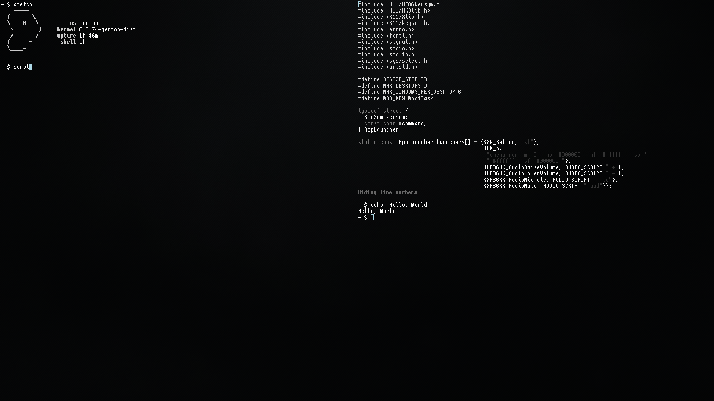

# Minimal Window Manager (MWM)

MWM (Minimal Window Manager) is a lightweight, minimalistic window manager written in **C**.
 
It was designed with the following guiding principles:
* < 500 lines of code (clang-formatted).
* 9 Desktops.
* High Performance.
* No status bar, Borders or Gaps. [(if you want them, use mwm+)](https://github.com/KrzysztofMarciniak/minimal-window-manager-plus)
* No floating windows.
* No compiler warnings, clean builds only.
* One file.


## Stats
```bash
~/minimal-window-manager $ bloaty mwm 
    FILE SIZE        VM SIZE    
 --------------  -------------- 
  44.9%  9.93Ki   0.0%       0    [Unmapped]
  14.4%  3.19Ki  30.8%  3.12Ki    .text
   5.0%  1.12Ki  10.4%  1.05Ki    .dynsym
   4.4%    1000   9.0%     936    .rela.plt
   4.0%     900   2.4%     250    [14 Others]
   3.5%     800   7.7%     800    [LOAD #2 [R]]
   3.1%     704   6.2%     640    .plt
   3.0%     688   6.0%     624    .plt.sec
   3.0%     678   5.9%     614    .dynstr
   2.5%     576   4.9%     512    .dynamic
   2.2%     488   4.1%     424    .rodata
   1.9%     440   3.6%     376    .got
   1.9%     424   3.5%     360    .rela.dyn
   1.4%     324   0.0%       0    .shstrtab
   1.0%     224   1.5%     160    .eh_frame
   0.7%     160   0.9%      96    .data.rel.ro
   0.7%     154   0.9%      90    .gnu.version
   0.6%     144   0.8%      80    .gnu.version_r
   0.6%     144   0.8%      80    .note.gnu.property
   0.6%     128   0.0%       0    [ELF Headers]
   0.5%     116   0.5%      52    .eh_frame_hdr
 100.0%  22.1Ki 100.0%  10.1Ki    TOTAL
~/minimal-window-manager $ size mwm 
   text    data     bss     dec     hex filename
   8491    1024      40    9555    2553 mwm
~/minimal-window-manager $ ldd mwm 
        linux-vdso.so.1 (0x00007fff60af7000)
        libX11.so.6 => /usr/lib64/libX11.so.6 (0x00007f80938f0000)
        libc.so.6 => /usr/lib64/libc.so.6 (0x00007f8093704000)
        libxcb.so.1 => /usr/lib64/libxcb.so.1 (0x00007f80936d7000)
        /lib64/ld-linux-x86-64.so.2 (0x00007f8093a6d000)
        libXau.so.6 => /usr/lib64/libXau.so.6 (0x00007f80936d1000)
        libXdmcp.so.6 => /usr/lib64/libXdmcp.so.6 (0x00007f80936c9000)
```

## Getting Started

### Media Keys
Below are two examples for handling media keys. You can modify these to suit your needs. To use them out of the box, you will need [herbe](https://github.com/dudik/herbe), or modify (`notifications_daemon="/usr/local/bin/herbe"` - .sh) or (`#define NOTIFICATIONS_DAEMON "/usr/local/bin/herbe"` - .c)
Makefile:
```bash
-DAUDIO_SCRIPT="\"$(shell pwd)/audio.sh\""
```
or (after compiling `gcc audio.c -o audio`):
```bash
-DAUDIO_SCRIPT="\"$(shell pwd)/audio\""
```

### Keyboard Shortcuts

#### Window Management
- **Mod + Enter**: Launch terminal
- **Mod + q**: Close focused window
- **Mod + Shift + q**: Exit MWM
- **Mod + j**: Focus left window
- **Mod + k**: Focus right window
- **Mod + Shift + l**: Increase window size
- **Mod + Shift + h**: Decrease window size

#### Desktop Navigation
- **Mod + [0-9]**: Switch to desktop [0-9]
- **Mod + Shift + [0-9]**: Move focused window to desktop [0-9]

#### Application Launcher
- **Mod + p**: Launch dmenu (application menu)

## Prerequisites
To build and run MWM, you'll need:
- A C compiler (e.g., `gcc`).
- `make` for building the project.
- A Linux-based environment with X11 support.

Optional, but recommended:
- `st` (simple terminal).
- `dmenu` (for launching applications).

### Building the Project
#### default (`recommended`) (lower in runtime memory but bigger disk size.):
1. Clone the repository:
```bash
git clone https://github.com/KrzysztofMarciniak/minimal-window-manager.git
```
2. Navigate to the project directory: 
```bash
cd minimal-window-manager
```
3. Install:
```bash
sudo make install
```
4. Add to xinitrc:

```bash
exec dbus-launch --sh-syntax --exit-with-session mwm
```
#### compressed (higher in runtime memory, smaller in disk size.):
0. You have to install [upx](https://github.com/upx/upx).
1. Clone the repository:
```bash
git clone https://github.com/KrzysztofMarciniak/minimal-window-manager.git
```
2. Navigate to the project directory: 
```bash
cd minimal-window-manager
```
3. Install the compressed version:
```bash
sudo make install_compressed
```
4. Add to xinitrc:
```bash
exec dbus-launch --sh-syntax --exit-with-session mwm.upx
```